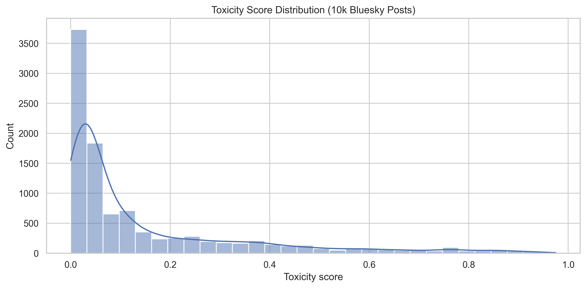
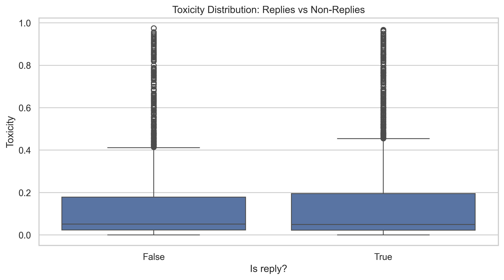
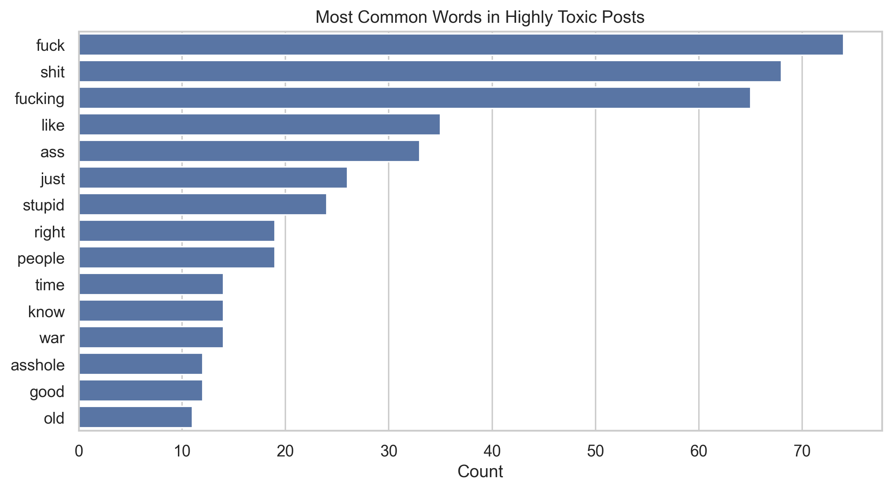
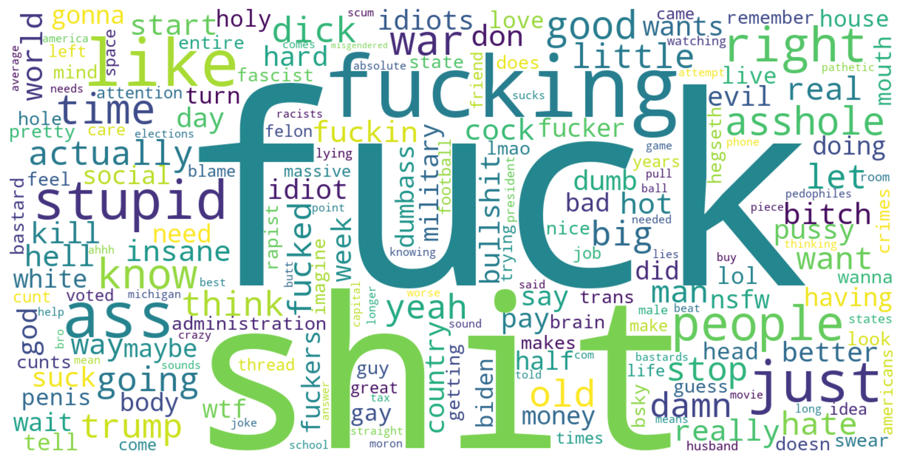
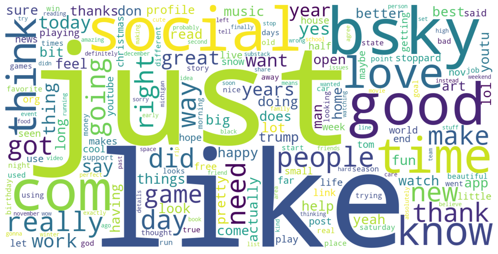

# Bluesky Toxicity Analysis

An end-to-end data pipeline that streams live posts from the Bluesky firehose, stores and cleans them in DuckDB, scores a sample for toxicity with the Google Perspective API, and trains a model to predict those scores from text alone.

**100,000 posts** captured live → **65,979** cleaned → **10,000** scored → **R² 0.551** predicting toxicity from text.

The headline finding: Bluesky is far less toxic than its discourse suggests. The median post scores **0.051** out of 1.0, and only **3.5%** of posts cross a 0.7 toxicity threshold. Toxicity lives in a small, bursty tail — not spread across the feed.



---

## Pipeline

```
Bluesky Firehose (websocket)
        │  atproto client, CAR block decoding, auto-reconnect
        ▼
   raw_firehose ──── 100,000 posts, unmodified capture
        │  English filter + URL/emoji/symbol stripping (Python UDF registered into SQL)
        ▼
   clean_posts  ──── 65,979 posts, + derived is_reply / hour / day
        │  deterministic hash-ordered sample, seed 42
        ▼
   sample_posts ──── 10,000 posts
        │  Perspective API, 60 RPM, exponential backoff, resumable
        ▼
   toxicity scores → analysis + TF-IDF/Ridge model
```

| Stage | Script | What it does |
|-------|--------|--------------|
| Ingest | [`load_firehose.py`](scripts/load_firehose.py) | Subscribes to the `com.atproto.sync.subscribeRepos` event stream, decodes CAR blocks, keeps only `app.bsky.feed.post` creates, reconnects automatically on disconnect |
| Clean | [`clean_firehose.py`](scripts/clean_firehose.py) | Registers a Python cleaning function as a DuckDB UDF and applies it inside SQL; filters to English, strips URLs/emoji/symbols, derives time and reply fields |
| Sample | [`sample_posts.py`](scripts/sample_posts.py) | Draws a reproducible 10,000-post sample by ordering on `hash(uri \|\| seed)` rather than `RANDOM()`, so re-runs are identical |
| Score | [`score_toxicity.py`](scripts/score_toxicity.py) | Calls the Perspective API within its 60 RPM quota, with exponential backoff on 429s; scores only rows where `toxicity IS NULL`, making it safely interruptible |
| Analyze | [`toxicity_analysis.ipynb`](scripts/toxicity_analysis.ipynb) | Distribution, reply comparison, temporal spikes, length correlation, word clouds |
| Model | [`toxicity_ml.ipynb`](scripts/toxicity_ml.ipynb) | TF-IDF + Ridge regression predicting toxicity from post text |

**Stack:** Python · DuckDB · atproto · Google Perspective API · scikit-learn · pandas · matplotlib/seaborn

---

## Findings

| Question | Answer |
|----------|--------|
| How toxic is Bluesky? | Mostly not. Median 0.051, mean 0.146, and 96.5% of posts score below 0.7. |
| Are replies more toxic than top-level posts? | **No** — 0.147 vs 0.146, a gap dwarfed by the ~0.20 within-group standard deviation. The "replies are where fights happen" intuition doesn't hold. |
| Do longer posts get angrier? | Barely. Length–toxicity correlation is just **0.125**. |
| Is toxicity steady over time? | No. Minute-level averages swung from near zero to **0.654**, with two minutes more than two standard deviations above the mean — toxicity arrives in bursts. |
| What marks a toxic post? | Explicit profanity dominates the ≥ 0.7 vocabulary, while low-toxicity posts read as ordinary conversation. |

<p align="center">
  
  
</p>

### Toxic vs. ordinary vocabulary

Word clouds over the two ends of the distribution — posts scoring **≥ 0.7** against posts scoring **< 0.1**.

**Highly toxic posts (≥ 0.7)**



**Low-toxicity posts (< 0.1)**



Stopwords are removed from both, so what remains is the vocabulary that actually separates them. Profanity dominates the toxic cloud — *fuck* (74), *shit* (68), *fucking* (65), *ass*, *stupid*, *asshole* — and is entirely absent below it, where the most frequent terms are ordinary conversation: *good*, *love*, *time*, *thank*, *new*, *happy*.

## Model

TF-IDF (20,000 features, unigrams + bigrams, English stopwords removed) → Ridge regression (`alpha=1.0`), 80/20 split.

| Metric | Value |
|--------|-------|
| RMSE | 0.1345 |
| R² | 0.5515 |

Bag-of-ngrams features alone explain ~55% of the variance in Perspective's scores, which fits the lexical picture above: toxicity is substantially, but not entirely, driven by explicit word choice. The remaining variance is the context-dependent kind — sarcasm, targeted insults without profanity, identity-directed language — that a linear model over n-grams can't reach.

---

## Data

A single DuckDB file, `data/bluesky.duckdb`, with three tables joined on `uri` (the AT Protocol record URI).

```sql
raw_firehose (100,000)  uri, cid, repo, text, created_at, langs[], reply_root_uri, reply_parent_uri
clean_posts   (65,979)  uri, cid, repo, text, created_at, is_reply, parent_uri, month, day, hour
sample_posts  (10,000)  uri, text, created_at, toxicity
```

`sample_posts.toxicity` is a 0–1 double from Perspective's TOXICITY attribute; it is null only for unscored rows, which is what makes the scoring stage resumable.

**Toxicity distribution (n = 10,000):**

| Min | 25% | Median | 75% | Max | Mean | Std Dev |
|-----|-----|--------|-----|-----|------|---------|
| 0.00003 | 0.0230 | 0.0506 | 0.1884 | 0.9750 | 0.1465 | 0.1983 |

## Limitations

- **Single capture window.** All 100,000 posts come from one ~3-hour window on 2025-11-29. Whatever was trending then is baked in, and the two detected spikes are almost certainly individual conversations rather than platform properties. Day-to-day variance is likely far larger than the ±0.002 sampling error on the mean.
- **Label bias.** Perspective is documented to over-score text containing identity terms and reclaimed slurs, and to be less reliable on African American English and other non-standard dialects. These scores are "what this model predicts a reader would perceive," not ground truth.
- **Language filtering.** English selection trusts the client-declared `langs` field, so mislabeled and multilingual posts are dropped.
- **Cleaning is lossy.** Stripping emoji and non-ASCII symbols removes genuine tone signal and disproportionately affects non-Latin scripts.

## Running it

The DuckDB file and logs are gitignored. The firehose is a live stream, so a re-run collects different posts and won't reproduce these exact numbers.

```bash
python -m venv .venv && source .venv/bin/activate
pip install -r requirements.txt
export PERSPECTIVE_API_KEY="your-key-here"

python scripts/load_firehose.py     # 100,000 live posts → raw_firehose
python scripts/clean_firehose.py    # → clean_posts
python scripts/sample_posts.py      # → 10,000-post sample
python scripts/score_toxicity.py    # scores the sample (~3.5 hrs at 60 RPM)
```

Then run the two notebooks in `scripts/` to regenerate the figures and model. Each stage writes a timestamped log to `logs/`.
